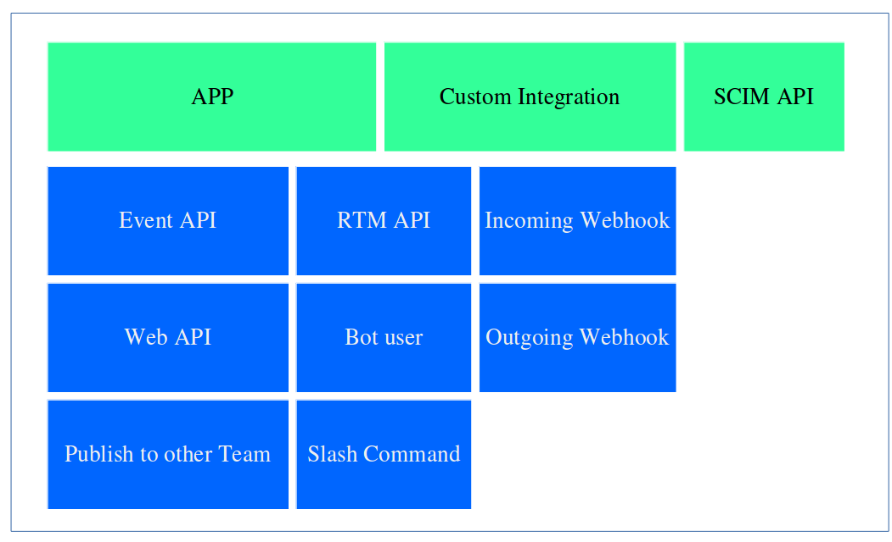

# Slack API Guideline

슬랙에서 사용할 수 있는 API는 아래와 같이 분류됩니다. 

- [APP](./app/README.md) : 타 팀에 배포 혹은 App Directory에 배포하기위해선 App단위로 개발을 해야합니다.
    - Event API : 허용된 권한내의 이벤트들을 지정한 url로 https 방식으로 callback을 받을 수 있습니다.
    - Web API : 허용된 권한내의 사용할 수 있는 기능들을 슬랙서버로 https 방식으로 요청 보낼 수 있습니다. 
    - Publish : Integration과의 차이로, 타 팀으로 배포가 가능합니다. 
- [Custom Integration](./integration/README.md) : 간단하게 내 팀에서만 사용할거라면 Integration으로 개발할 수 있습니다.
    - Incoming Webhook : 채팅전송 등 몇가지 기능을 POST방식으로 슬랙서버로 요청만 가능합니다.
    - Outgoing Webhook : 특정 채널 혹은 특정 단어에 대해서 지정된 url로 http 방식으로 callback을 받을 수 있습니다.
- APP과 Integration 공용 
    - RTM API : websocket방식으로 지정된 권한 내에서 이벤트를 실시간으로 받고 요청을 보낼 수 있습니다.
    - Bot User : 봇을 하나의 '유저'와 같이 이용 할 수 있습니다.
    - Slash Command : 지정된 커맨드를 입력하면 http(s) 방식으로 지정된 url로 callback을 받을 수 있고 응답이 가능합니다.
- SCIM API : SSO 로그인을 위한 api입니다.

[App API 가이드 문서](./bot.md)  
[Integration API 가이드 문서](./bot.md)